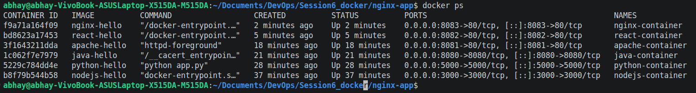
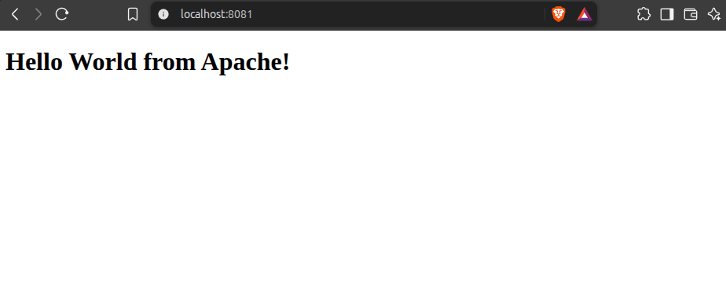
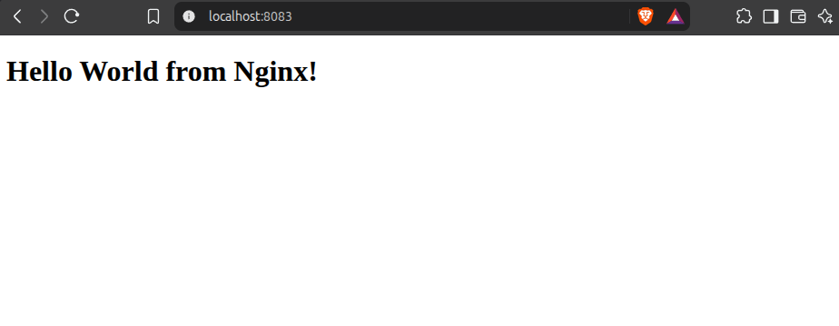
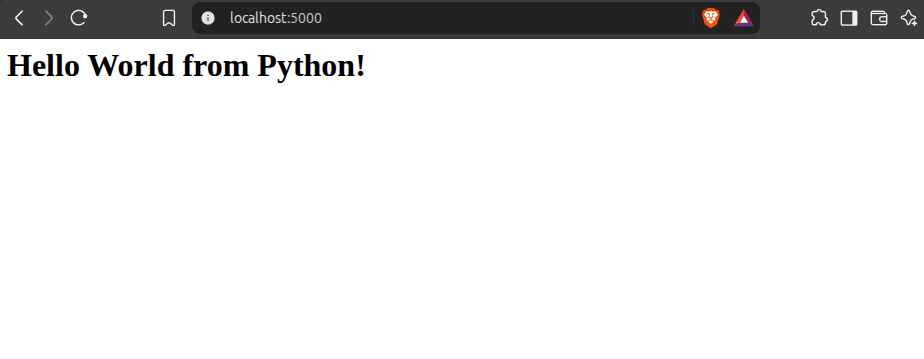
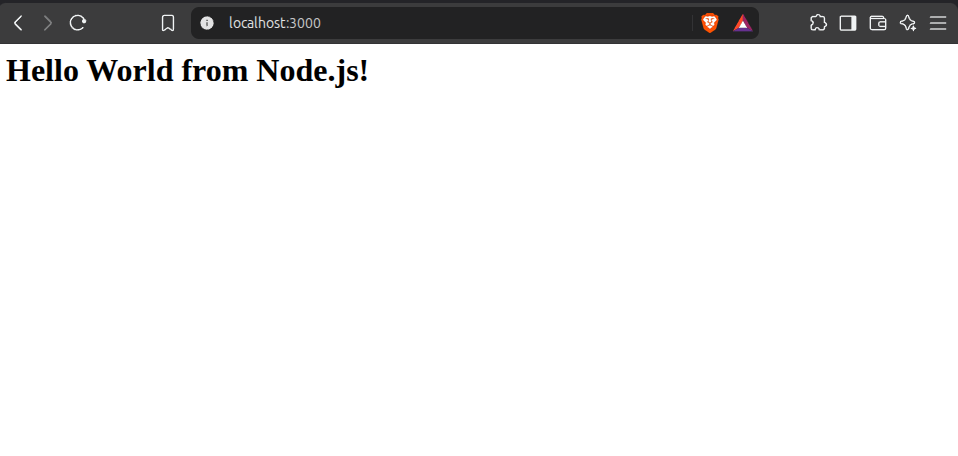
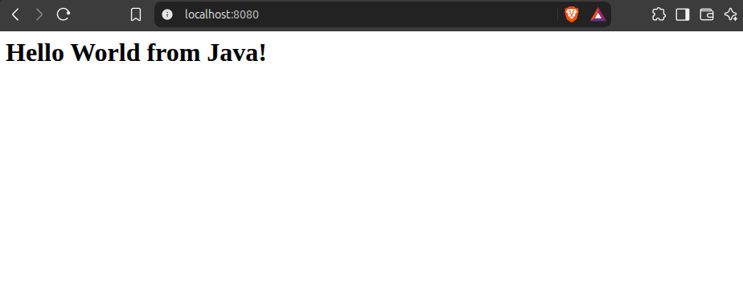

# Lecture 6 -- Docker Hello World Applications

## Docker Containers Running

The following containers are running:

## 1. Apache App

## 2. Nginx App

## 3. Python App

## 4. Node App

## 5. Java App

## 6. React App
