### Task 1: Kubernetes Port Architecture & Clarification Drill

- **Short Description:** Document and visually map the 4 distinct port definitions in Kubernetes. Illustrate how a packet flows from an external client through the node, into the service, and down to the application process inside the container.
- **Manifest Reference:** Concept mapping across all `service.yaml` and `app-deployment.yaml` files.
- **Key Commands to Run:**
    
    ```bash
    # Inspect port declarations across pod and service
    kubectl explain pod.spec.containers.ports.containerPort
    kubectl explain service.spec.ports
    ```
    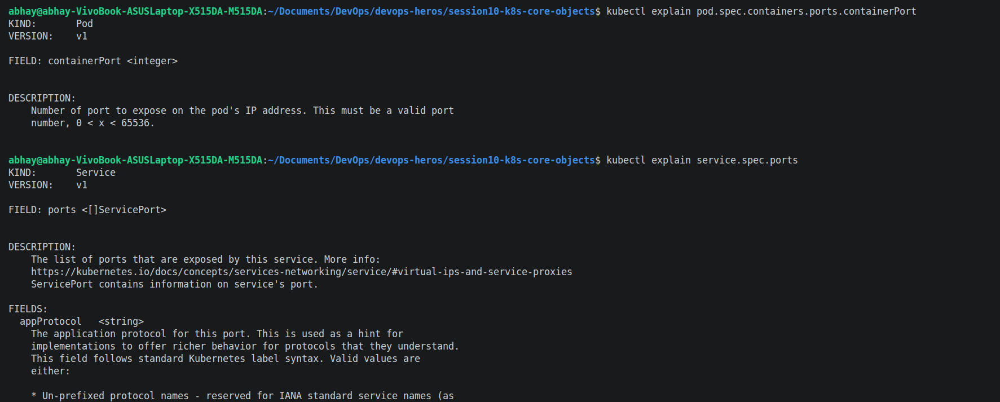
    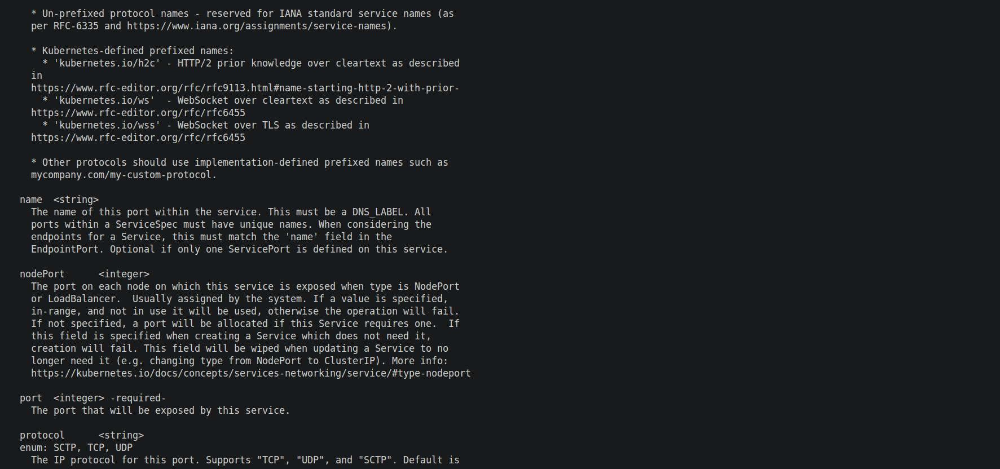
    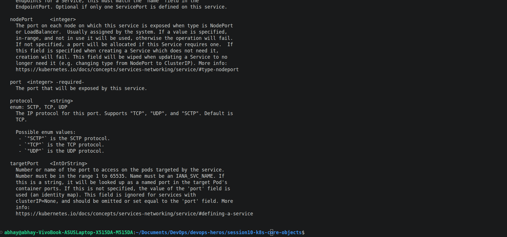


### Task 2: Type 1 Service — ClusterIP (Default Internal Networking)

- **Short Description:** Deploy a 3-replica backend (`web-app-clusterip`), create a `ClusterIP` service on port `8080` targeting container port `80`, inspect automatic endpoint binding, and test connectivity from an ephemeral client pod using short names and full FQDN.
- **Working Directory:** `session-11-kubernetes-services/01-clusterip/`
- **Commands to Run:**
    
    ```bash
    # 1. Deploy backend app and ClusterIP service
    kubectl apply -f 01-clusterip/app-deployment.yaml
    kubectl apply -f 01-clusterip/service.yaml
    
    # 2. Verify pods, service, and endpoints
    kubectl get pods -l app=web-clusterip -o wide
    kubectl get svc web-service-clusterip
    kubectl get endpoints web-service-clusterip
    
    # 3. Deploy diagnostic client pod
    kubectl apply -f 01-clusterip/client-pod.yaml
    kubectl wait --for=condition=ready pod/curl-client --timeout=60s
    
    # 4. Test internal resolution methods from inside the cluster
    kubectl exec -it curl-client -- curl -s <http://web-service-clusterip:8080> | grep -i "<title>"
    kubectl exec -it curl-client -- curl -s <http://web-service-clusterip.default.svc.cluster.local:8080> | grep -i "<title>"
    ```
    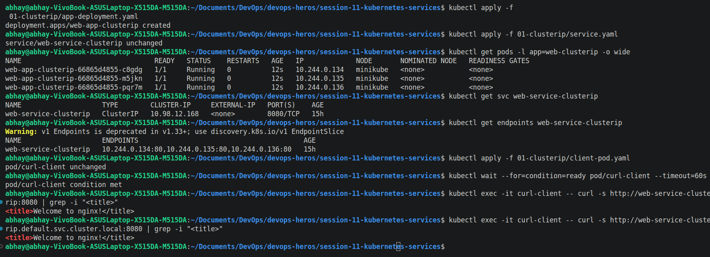


### Task 3: Type 2 Service — NodePort (Host-Level External Ingress)

- **Short Description:** Deploy a 2-replica Nginx app and expose it externally by opening port `30080` on every cluster node. Verify that hitting any node IP on port `30080` directs traffic to the underlying pods.
- **Working Directory:** `session-11-kubernetes-services/02-nodeport/`
- **Commands to Run:**
    
    ```bash
    # 1. Deploy application and NodePort service
    kubectl apply -f 02-nodeport/app-deployment.yaml
    kubectl apply -f 02-nodeport/service.yaml
    
    # 2. Verify the NodePort mapping
    kubectl get svc web-service-nodeport
    
    # 3. Retrieve Minikube IP and verify node port access
    MINIKUBE_IP=$(minikube ip)
    curl -I <http://$>{MINIKUBE_IP}:30080
    
    # 4. Alternatively test via minikube service tunnel (macOS/Docker driver)
    minikube service web-service-nodeport --url
    ```
    Terminal Output:
    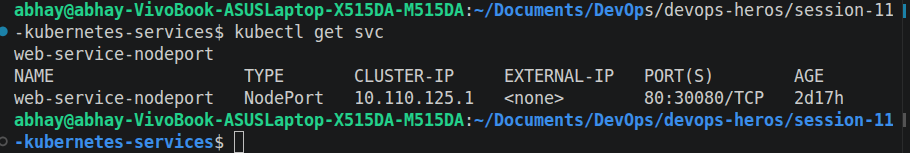

    Browser Output:
    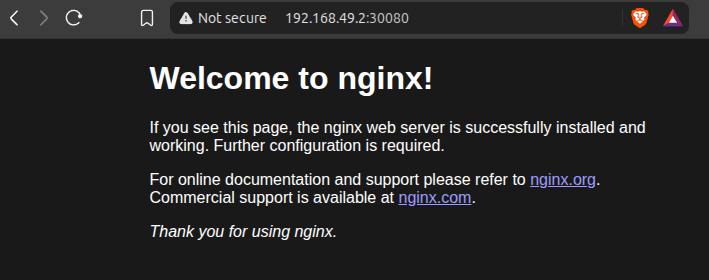


### Task 4: Type 3 Service — LoadBalancer (Cloud-Native Ingress Simulation)

- **Short Description:** Deploy a 3-replica workload exposed through `type: LoadBalancer`. Use `minikube tunnel` to simulate a cloud provider assigning an `EXTERNAL-IP`, and confirm that Kubernetes automatically configures internal `NodePort` and `ClusterIP` layers.
- **Working Directory:** `session-11-kubernetes-services/03-loadbalancer/`
- **Commands to Run:**
    
    ```bash
    # 1. Deploy application and LoadBalancer service
    kubectl apply -f 03-loadbalancer/app-deployment.yaml
    kubectl apply -f 03-loadbalancer/service.yaml
    
    # 2. Check service status (will initially show <pending> without tunnel)
    kubectl get svc web-service-loadbalancer
    
    # 3. In a separate terminal, start the Minikube LoadBalancer tunnel
    minikube tunnel
    
    # 4. In primary terminal, observe EXTERNAL-IP populated
    kubectl get svc web-service-loadbalancer
    
    # 5. Access the application directly on standard port 80
    EXTERNAL_IP=$(kubectl get svc web-service-loadbalancer -o jsonpath='{.status.loadBalancer.ingress[0].ip}')
    curl -s <http://$>{EXTERNAL_IP}:80 | grep -i "<title>"
    ```
    Terminal Output:
    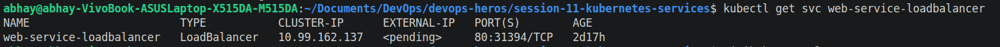


### Task 5: Type 4 Service — ExternalName (CoreDNS CNAME Alias Redirection)

- **Short Description:** Create an `ExternalName` service that acts as an internal DNS CNAME alias pointing to an external domain (e.g., `api.github.com`). Verify that no cluster IP or endpoints are created, and confirm CNAME resolution using `nslookup`.
- **Working Directory:** `session-11-kubernetes-services/04-externalname/`
- **Commands to Run:**
    
    ```bash
    # 1. Apply ExternalName service and client pod
    kubectl apply -f 04-externalname/service.yaml
    kubectl apply -f 04-externalname/client-pod.yaml
    kubectl wait --for=condition=ready pod/dns-test-client --timeout=60s
    
    # 2. Inspect the service (Notice CLUSTER-IP is <none>, EXTERNAL-IP is the target domain)
    kubectl get svc external-database-service
    
    # 3. Verify DNS resolution returns canonical name (CNAME)
    kubectl exec -it dns-test-client -- nslookup external-database-service
    
    # 4. Test outbound traffic through the alias
    kubectl exec -it dns-test-client -- curl -s -k <https://external-database-service>
    ```
    Terminal Output:
    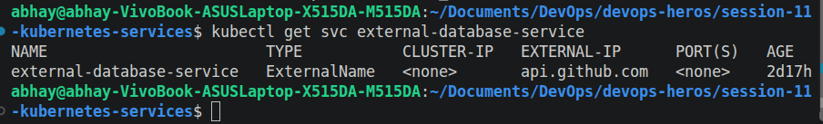


### Task 6: Type 5 Service — Headless Service (`clusterIP: None` & Stateful Workloads)

- **Short Description:** Deploy a 3-replica `StatefulSet` with a Headless Service (`clusterIP: None`). Prove that CoreDNS returns individual `A` records for all matching Pod IPs directly rather than a single VIP, and curl an ordinal pod hostname directly.
- **Working Directory:** `session-11-kubernetes-services/05-headless/`
- **Commands to Run:**
    
    ```bash
    # 1. Apply Headless service and StatefulSet
    kubectl apply -f 05-headless/service.yaml
    kubectl apply -f 05-headless/app-statefulset.yaml
    kubectl apply -f 05-headless/client-pod.yaml
    
    # 2. Wait for stateful pods (web-stateful-0, 1, 2) to become Ready
    kubectl rollout status statefulset/web-stateful --timeout=120s
    kubectl get pods -l app=web-headless -o wide
    
    # 3. Inspect Service (Notice CLUSTER-IP is explicitly None)
    kubectl get svc web-service-headless
    
    # 4. Perform DNS lookup on Headless Service name -> Returns ALL pod IPs
    kubectl exec -it headless-dns-client -- nslookup web-service-headless
    
    # 5. Query an individual Pod directly via its stable FQDN
    kubectl exec -it headless-dns-client -- nslookup web-stateful-0.web-service-headless.default.svc.cluster.local
    kubectl exec -it headless-dns-client -- curl -s <http://web-stateful-0.web-service-headless:80> | grep -i "<title>"
    ```
    Terminal Output:
    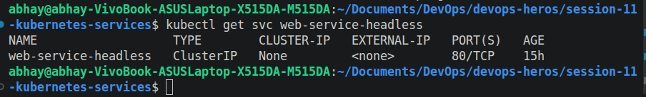


### Task 7: Services Without Selectors (Manual Endpoints Mapping)

- **Short Description:** Define a Service without selectors (`empty-endpoints.yaml` pattern) and manually bind it to an external backend IP address using a separate `Endpoints` manifest. Demonstrate how Kubernetes abstracts legacy or external infrastructure.
- **Commands to Run:**
    
    ```bash
    # 1. Create Service without a selector
    cat <<EOF | kubectl apply -f -
    apiVersion: v1
    kind: Service
    metadata:
      name: external-legacy-db
    spec:
      ports:
        - protocol: TCP
          port: 3306
          targetPort: 3306
    EOF
    
    # 2. Verify endpoints are initially empty (<none>)
    kubectl get endpoints external-legacy-db
    
    # 3. Manually create matching Endpoints object pointing to external IP
    cat <<EOF | kubectl apply -f -
    apiVersion: v1
    kind: Endpoints
    metadata:
      name: external-legacy-db
    subsets:
      - addresses:
          - ip: 192.168.1.150
        ports:
          - port: 3306
    EOF
    
    # 4. Verify endpoints are now successfully attached
    kubectl get endpoints external-legacy-db
    ```
    Terminal Output:
    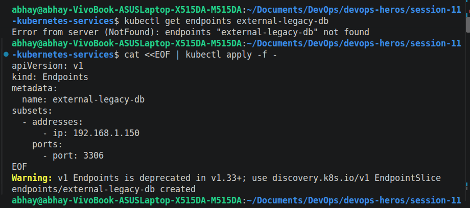
    
    Terminal Output:
    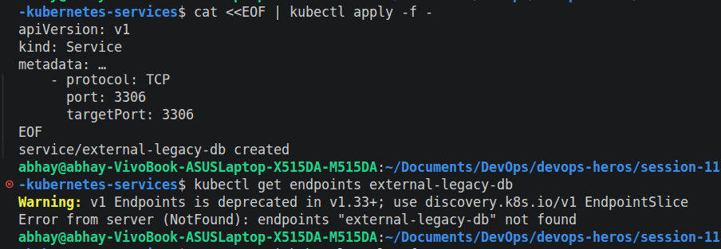
    
    Terminal Output:
    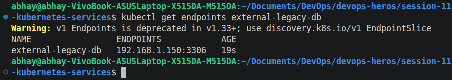


### Task 8: FQDN & CoreDNS Deep Dive Architecture Analysis

- **Short Description:** Inspect the cluster DNS configuration inside running pods. Break down the anatomy of a Kubernetes FQDN, examine `/etc/resolv.conf`, test search domain completion, and explain why `ndots:5` causes latency in production when making external API calls.
- **Commands to Run:**
    
    ```bash
    # 1. Verify CoreDNS pods are active in kube-system
    kubectl get pods -n kube-system -l k8s-app=kube-dns -o wide
    
    # 2. Inspect /etc/resolv.conf inside any running pod
    kubectl exec -it curl-client -- cat /etc/resolv.conf
    
    # 3. Test DNS search domain expansion
    # Querying 'web-service-clusterip' automatically expands to:
    # 'web-service-clusterip.default.svc.cluster.local'
    kubectl exec -it curl-client -- nslookup web-service-clusterip
    
    # 4. Demonstrate ndots:5 external query latency mechanism
    # Queries to an external domain (e.g., api.stripe.com) will traverse local search paths first
    kubectl exec -it curl-client -- nslookup api.github.com
    ```

    Terminal Output:
    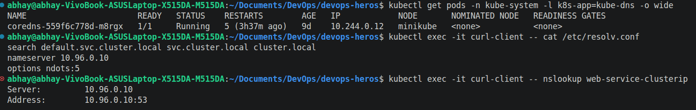
    Terminal Output:
    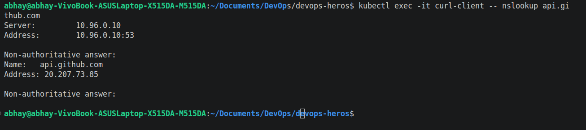


### Task 9: Pod Identity & Lifecycle Invariance Drill — Deployment (Stateless) vs. StatefulSet (Stateful)

- **Short Description:** Deploy both a stateless Deployment and an ordinal StatefulSet. Inspect their naming schemes, delete a running pod from each controller using `kubectl delete pod`, and observe that the Deployment spawns an ephemeral pod with a completely new random hash, whereas the StatefulSet strictly resurrects the exact same ordinal index (`web-stateful-0`).
- **Manifest Reference:**
    - Deployment: `session-11-kubernetes-services/01-clusterip/app-deployment.yaml`
    - StatefulSet: `session-11-kubernetes-services/05-headless/app-statefulset.yaml`
    - Service: `session-11-kubernetes-services/05-headless/service.yaml`
- **Commands to Run:**
    
    ```bash
    # 1. Apply both workloads
    kubectl apply -f session-11-kubernetes-services/01-clusterip/app-deployment.yaml
    kubectl apply -f session-11-kubernetes-services/05-headless/service.yaml
    kubectl apply -f session-11-kubernetes-services/05-headless/app-statefulset.yaml
    
    # 2. Wait for pods to become Ready and observe the naming conventions
    kubectl get pods -l app=web-clusterip
    kubectl get pods -l app=web-headless
    
    # 3. Capture the exact pod names before deletion
    DEPLOY_POD=$(kubectl get pods -l app=web-clusterip -o jsonpath='{.items[0].metadata.name}')
    echo "Deleting Stateless Deployment Pod: ${DEPLOY_POD}"
    kubectl delete pod "${DEPLOY_POD}"
    
    # 4. Check the Deployment pods immediately — notice a brand-new random hash is generated!
    kubectl get pods -l app=web-clusterip
    
    # 5. Delete an ordinal StatefulSet pod (web-stateful-0)
    echo "Deleting StatefulSet Pod: web-stateful-0"
    kubectl delete pod web-stateful-0
    
    # 6. Check the StatefulSet pods immediately — notice web-stateful-0 is recreated identically!
    kubectl get pods -l app=web-headless
    ```

    Terminal Output:
    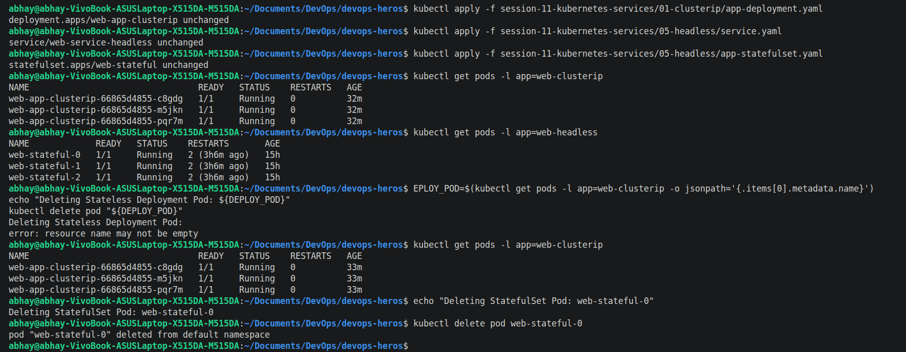
    Terminal Output:
    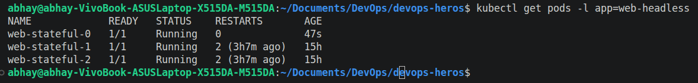


### Task 10: Master Architectural Matrix — Deployment vs. StatefulSet vs. DaemonSet

- **Short Description:** Create an engineering reference matrix evaluating the differences between Deployments, StatefulSets, and DaemonSets. Document their scheduling paradigms, storage lifetimes, identity models, network coupling, and failure domains.
- **Manifests Inspected:**
    - `session10-k8s-core-objects/deployment/deployment-v1.yaml`
    - `session10-k8s-core-objects/daemonset/node-agent-ds.yaml`
    - `session10-k8s-core-objects/k8s-core-objects/statefulset.yml`
- **Commands to Run:**
    
    ```bash
    # Inspect resource definitions and schema specifications
    kubectl explain deployment.spec
    kubectl explain statefulset.spec
    kubectl explain daemonset.spec
    ```

    ## Deployment vs StatefulSet vs DaemonSet

| **Aspect** | **Deployment** | **StatefulSet** | **DaemonSet** |
|---|---|---|---|
| **Typical Use** | Stateless applications, APIs, and web services | Stateful applications such as databases and distributed systems | Node-specific services and infrastructure agents |
| **Pod Naming** | Automatically generated names using ReplicaSet hashes | Stable, ordered names such as `app-0`, `app-1`, `app-2` | Names based on the DaemonSet and generated identifiers |
| **Pod Identity** | Pods are interchangeable and replaced when deleted | Each Pod maintains a stable identity and hostname | Each Pod is associated with a particular node |
| **Start / Stop Order** | Pods can be created or removed independently | Pods are normally created and terminated in an ordered sequence | Pods are deployed across eligible nodes, generally in parallel |
| **Storage** | Usually temporary or shared storage | Persistent storage can be attached to individual Pods using PVCs | Commonly uses node-local storage or `hostPath` volumes |
| **Service Pattern** | Can use `ClusterIP`, `NodePort`, or `LoadBalancer` | Usually uses a **Headless Service** (`clusterIP: None`) for stable Pod discovery | Usually accessed through a regular or node-local Service when required |
| **Scaling** | Replicas can be increased or decreased freely | Scaling follows the StatefulSet's ordered Pod identities | Automatically maintains a Pod on each eligible node |
| **Common Examples** | Nginx, Flask, Node.js APIs, frontend applications | MySQL, MongoDB, Kafka, Cassandra | Prometheus Node Exporter, Fluentd, monitoring and logging agents |


    
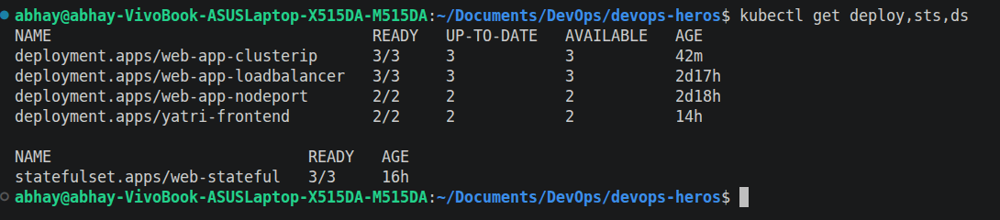


## Task 11: Production Cost Optimization & Service Selection Decision Tree

### Architecture Diagram

### Anti-Pattern: Separate Load Balancer for Every Service

```text
Service A ──► AWS Load Balancer 1 ──► ClusterIP A
Service B ──► AWS Load Balancer 2 ──► ClusterIP B
Service C ──► AWS Load Balancer 3 ──► ClusterIP C
                    ...
Service N ──► AWS Load Balancer N ──► ClusterIP N

Example:
50 services × $25/month
≈ $1,250/month
```

Recommended: Single Load Balancer with Ingress


                        Public Traffic
                          │
                          ▼
              ┌──────────────────────┐
              │  Single AWS Load     │
              │      Balancer        │
              └──────────┬───────────┘
                         │
                         ▼
              ┌──────────────────────┐
              │  NGINX Ingress       │
              │     Controller       │
              │                      │
              │ Host / Path Routing  │
              └───────┬───┬───┬──────┘
                      │   │   │
                      ▼   ▼   ▼
                   Service A  Service B  Service C
                      │          │          │
                      ▼          ▼          ▼
                  ClusterIP   ClusterIP   ClusterIP

```text
    Example cost comparison:
    Individual Load Balancers:
    50 × $25/month = $1,250/month

    Single Load Balancer + Ingress:
    1 × $25/month = $25/month

    Illustrative difference:
    $1,250 - $25 = $1,225/month
```


### Service Selection Logic
Use the following decision process when choosing a Kubernetes Service type:

                    Need to expose an application?
                              │
                              ▼
                    ┌───────────────────┐
                    │ Internal traffic  │
                    │      only?        │
                    └─────────┬─────────┘
                         Yes  │  No
                              │
                    ▼         ▼
               ClusterIP   Need external
                           access?
                              │
                     ┌────────┴────────┐
                     │                 │
                    Yes               No
                     │                 │
                     ▼                 ▼
             ┌───────────────┐      ClusterIP
             │ Need HTTP/    │
             │ HTTPS routing?│
             └───────┬───────┘
                 Yes │ No
                     │
             ▼       ▼
          Ingress   NodePort /
                    LoadBalancer


### Task 12: Minikube Docker-Driver Port Binding & Tunnel Gotcha Analysis

- **Short Description:** Analyze and document why running `curl http://<Node-IP>:<NodePort>` fails on macOS and Windows when using Minikube with the Docker driver. Execute and verify the two standard operational solutions: the temporary network forwarder (`minikube service <svc> --url`) and the continuous Layer 3 routing daemon (`minikube tunnel`).
- **Root Cause Explanation to Document:**
    - In standard bare-metal Linux clusters, the worker node IP belongs directly to a physical interface reachable on the local network.
    - When using Minikube on macOS or Windows with the Docker driver (`-driver=docker`), Minikube runs inside an **isolated Docker container**. The node IP (e.g., `192.168.49.2`) belongs to an internal Docker network bridge (`docker0`/`bridge`) that macOS/Windows host kernels cannot directly route to without specialized proxying.
- **Commands to Run & Verify Workarounds:**
    
    ```bash
    # 1. Re-verify the NodePort service is active
    kubectl get svc web-service-nodeport
    
    # 2. Attempt direct curl on Node IP (Demonstrating the failure)
    NODE_IP=$(minikube ip)
    echo "Testing direct connection to ${NODE_IP}:30080 (Expect timeout/failure on macOS Docker driver)..."
    curl --connect-timeout 2 -s <http://$>{NODE_IP}:30080 || echo "Connection Failed as expected!"
    
    # -------------------------------------------------------------
    # WORKAROUND 1: Dynamic Local Proxy via Minikube Service
    # -------------------------------------------------------------
    # Minikube binds an open loopback port on 127.0.0.1 directly into the Docker bridge
    minikube service web-service-nodeport --url
    
    # Test the output URL provided by minikube service (e.g., <http://127.0.0.1:51234>)
    # curl -I <http://127.0.0.1>:<generated-port>
    
    # -------------------------------------------------------------
    # WORKAROUND 2: Continuous L3 Route Tunnel (Production Simulation)
    # -------------------------------------------------------------
    # In a separate terminal window, launch minikube tunnel (requires sudo for host network routing tables):
    minikube tunnel
    
    # In your primary terminal, test direct localhost access on the mapped port:
    curl -I <http://localhost:30080>
    ```

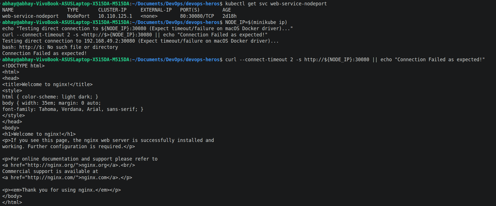
