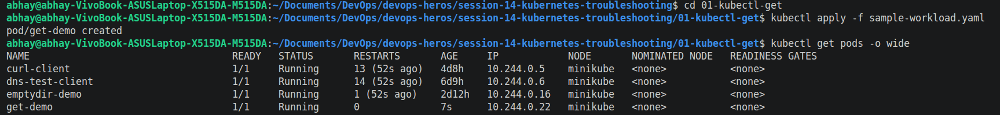
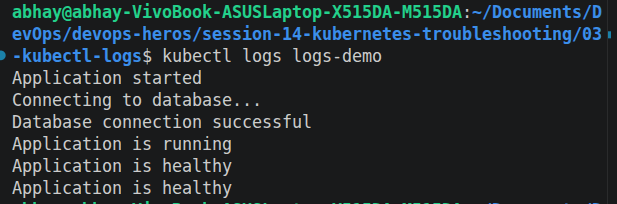
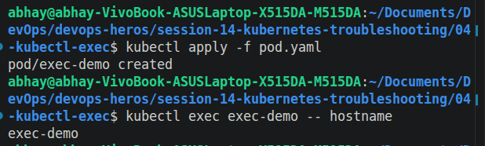
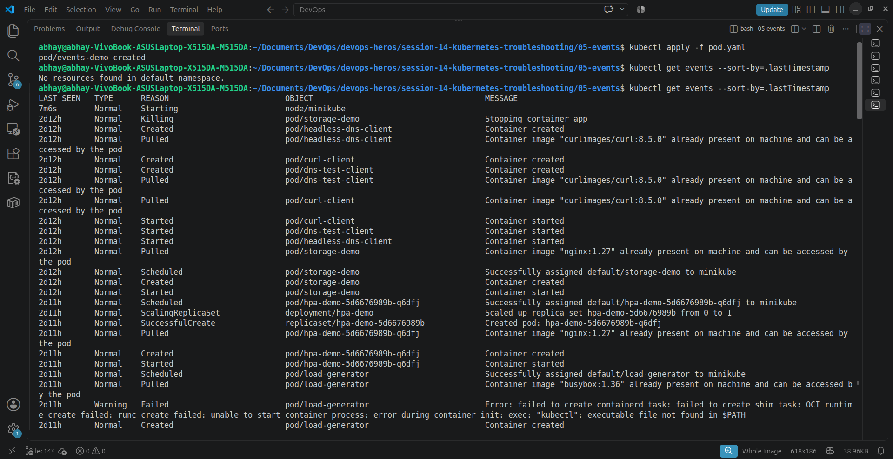
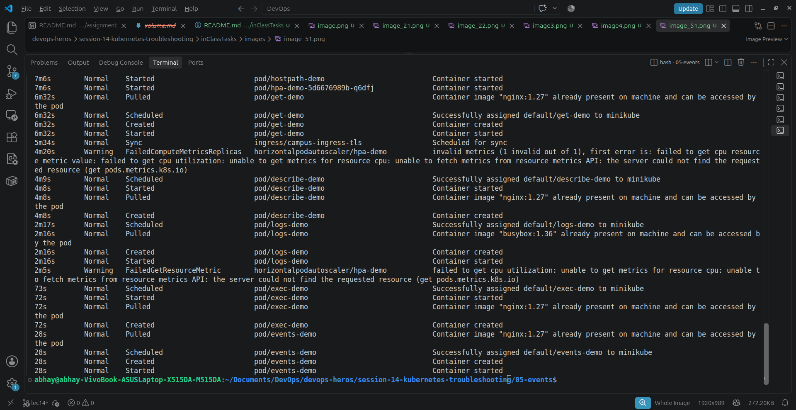
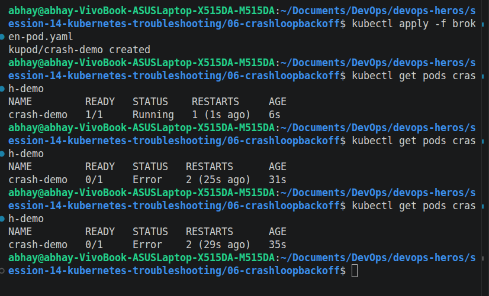
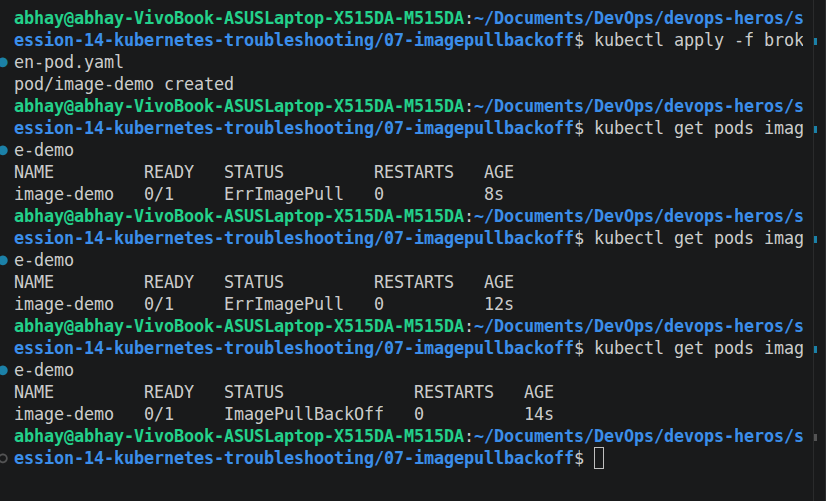
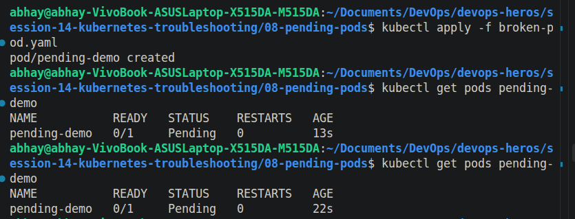
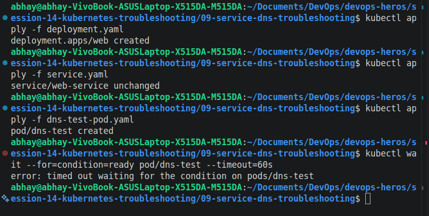

# Session 14: Kubernetes Troubleshooting Commands

## 1. Checking Pod Status (`kubectl get`)
*Demonstrates how to view the current state of resources.*

## 2. Inspecting Pod Details (`kubectl describe`)
*Demonstrates detailed resource information and lifecycle events.*

## 3. Viewing Application Output (`kubectl logs`)
*Demonstrates how to check standard output from inside the container.*

## 4. Running Commands Inside Containers (`kubectl exec`)
*Demonstrates how to interact directly with a running container.*

## 5. Monitoring Cluster Activity (`kubectl events`)
*Demonstrates tracking what the Kubernetes control plane is doing.*

## 6. Identifying CrashLoopBackOff
*Demonstrates a pod repeatedly failing and restarting due to an application exit error.*

## 7. Identifying ImagePullBackOff
*Demonstrates a pod failing to start because of an invalid or missing image tag.*

## 8. Identifying Pending Pods
*Demonstrates a pod waiting on the scheduler due to an unfulfillable node selector.*

## 9. Verifying Service DNS Resolution
*Demonstrates testing internal Kubernetes DNS routing from within a client pod.*
