# Session 15: Helm Assignment

## Task 1: Helm Commands

Screenshots:

### Chart Creation, Rendering, and Linting

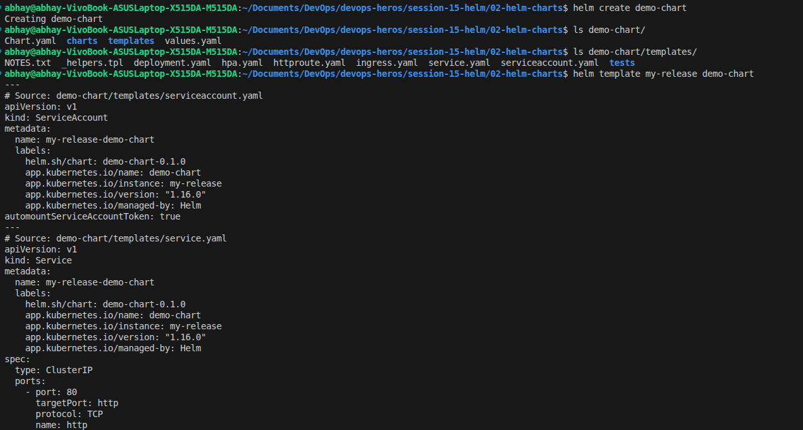

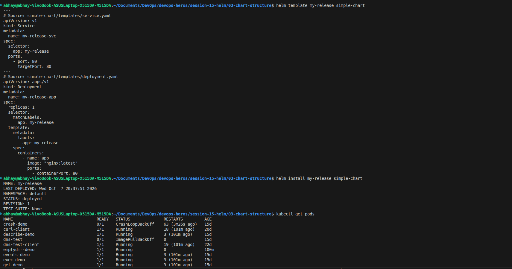

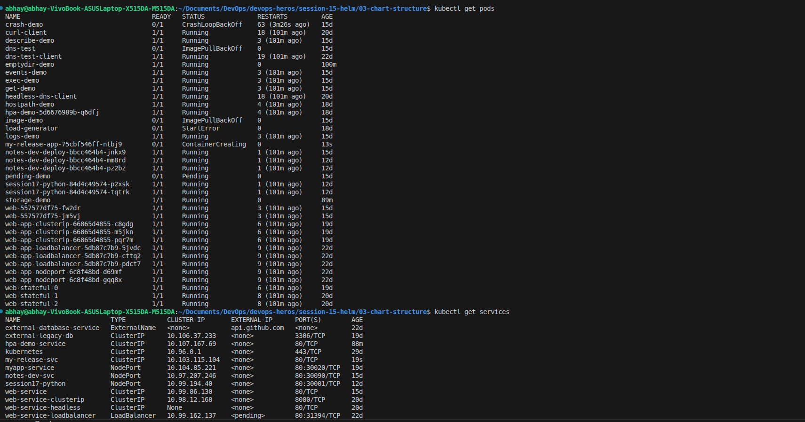

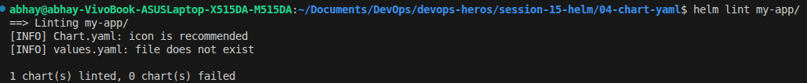

### Install, Upgrade, and Uninstall

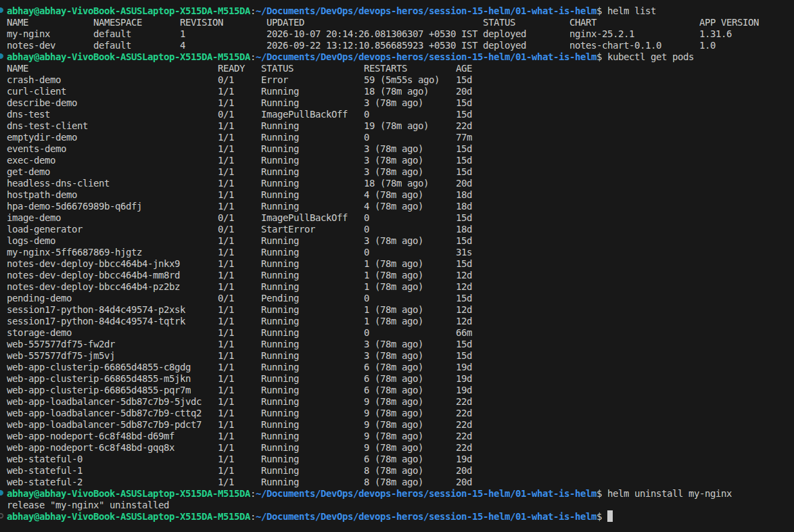

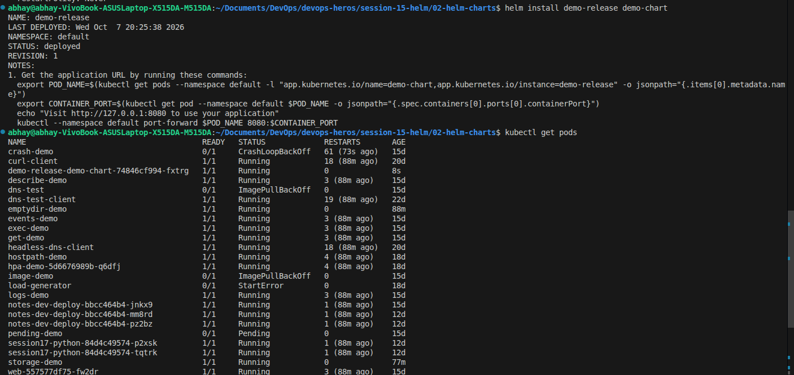

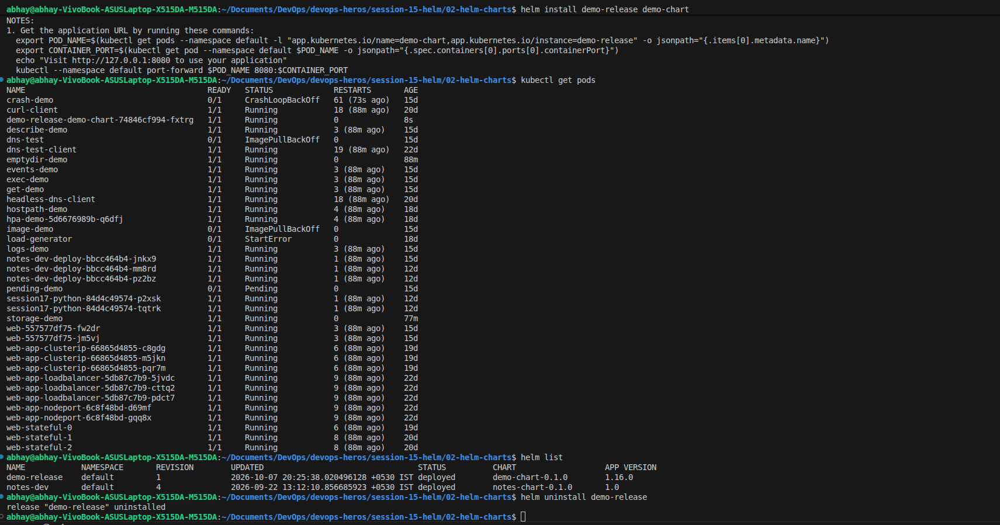

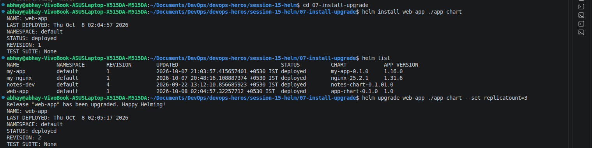

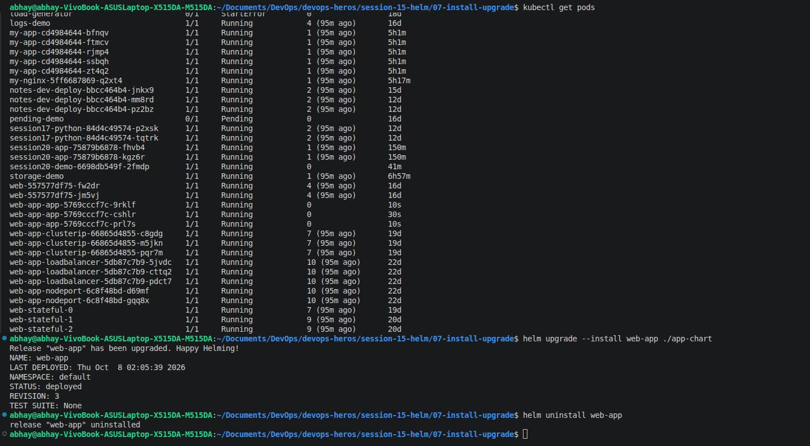

### Task 2 Rollback

## Guestbook Deployment and Rollback

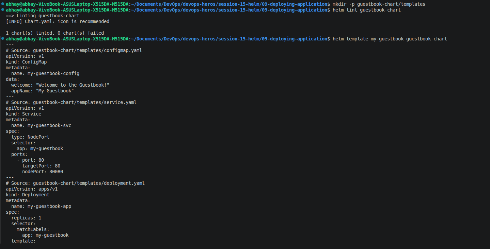

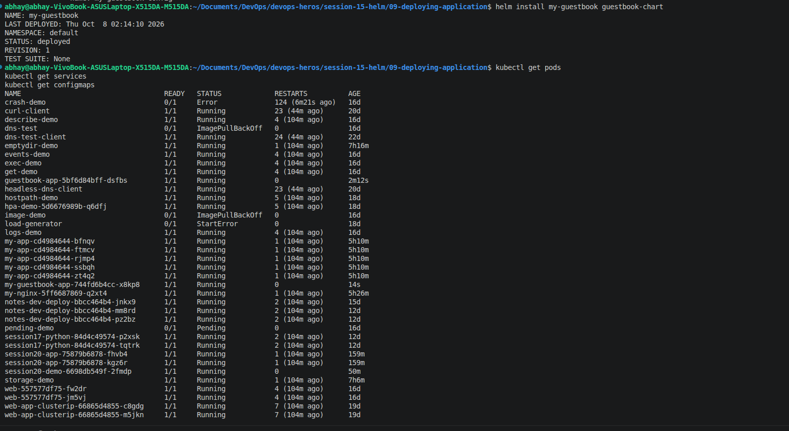

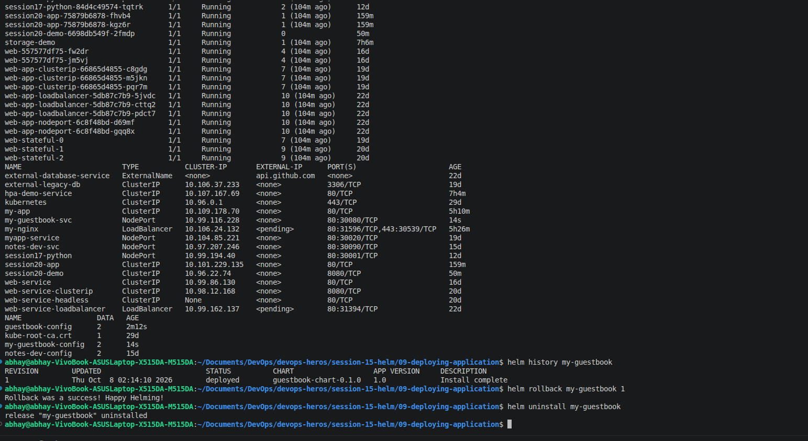

### Task 3: Mini-Project

The complete chart structure and commands are documented in [mini-project/README.md](../mini-project/README.md). The screenshots provide the following evidence:

1. **Lint and render:** `helm lint notes-chart` passed, and `helm template notes-dev notes-chart` rendered the ConfigMap, Service, and Deployment.

	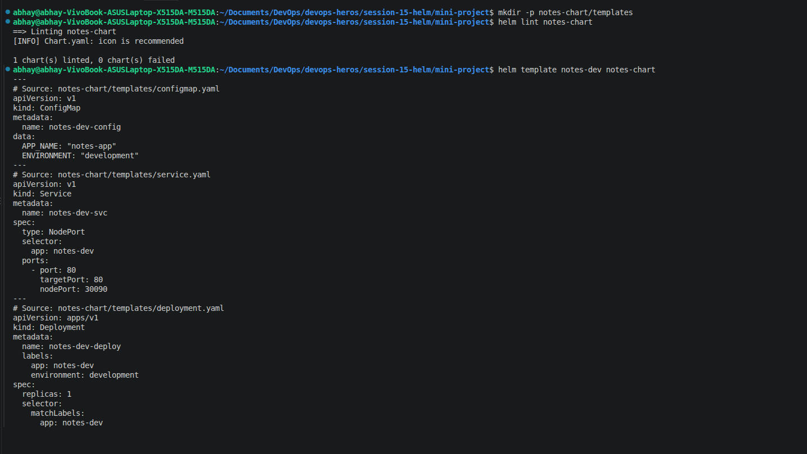

2. **Workload verification:** the output shows three `notes-dev-deploy` pods in `Running` state, along with the cluster's other workloads.

	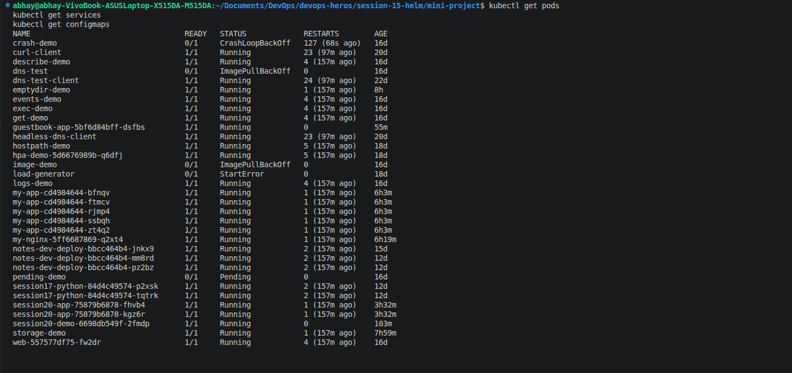

3. **Upgrade and rollback:** the screenshot shows the production-values upgrade, Helm history through revision 5, an upgrade with an invalid image tag, rollback to revision 2, and uninstall. It confirms the rollback command succeeded, but does not capture pod health after rollback.

	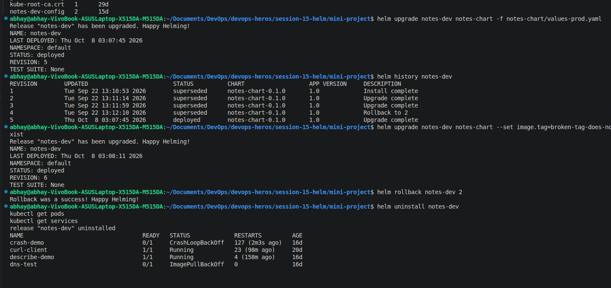

4. **Cleanup check:** the Service is absent, while the Notes pods are still `Terminating` in this immediate listing. Wait for deletion to finish before claiming all resources are gone.

	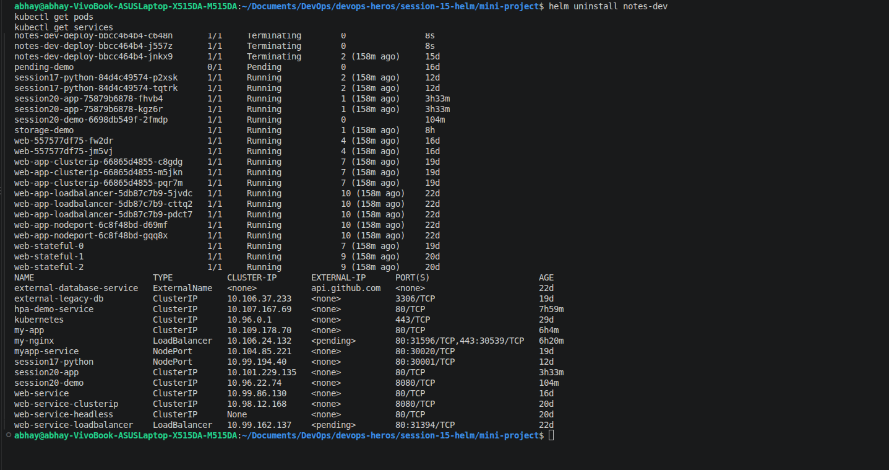

