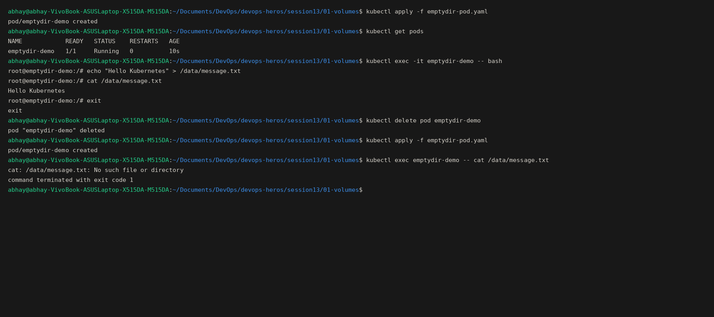
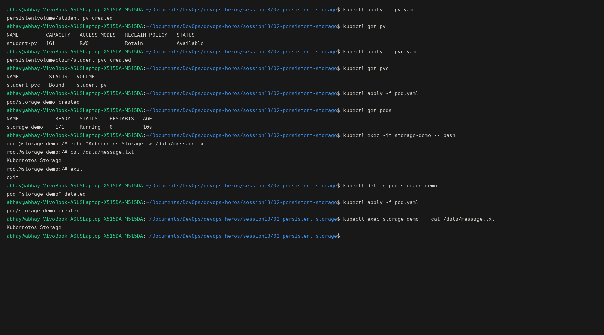
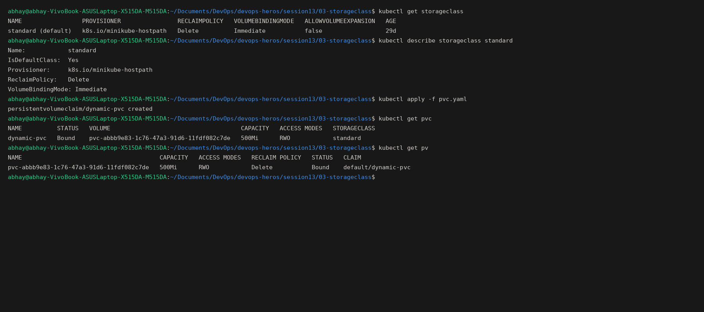
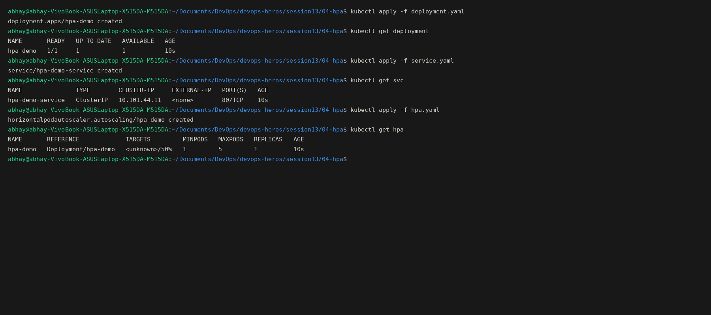
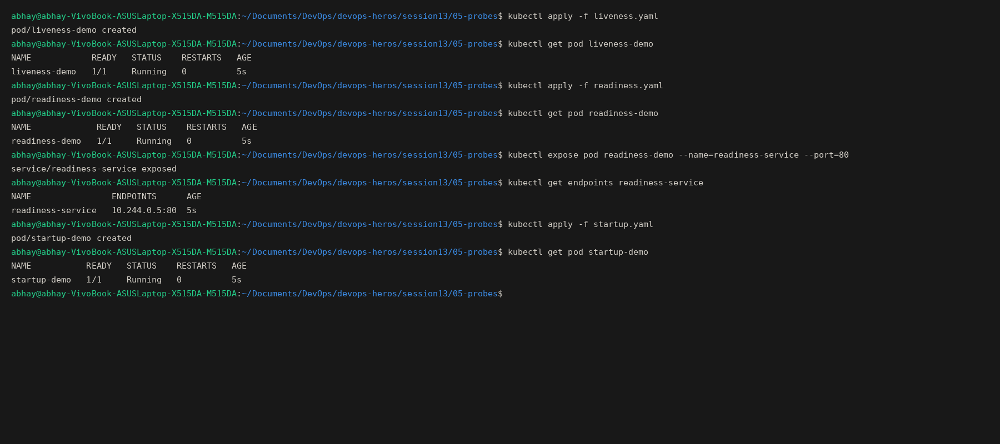

# Session 13 Assignment

## 01 - Volumes (emptyDir)

Tasks completed for `01-volumes`. Here is the screenshot of the execution:

## 02 - Persistent Storage

Tasks completed for `02-persistent-storage`. Here is the screenshot of the execution:

## 03 - StorageClass

Tasks completed for `03-storageclass`. Here is the screenshot of the execution:

## 04 - HPA

Tasks completed for `04-hpa`. Here is the screenshot of the execution:

## 05 - Probes

Tasks completed for `05-probes`. Here is the screenshot of the execution:

