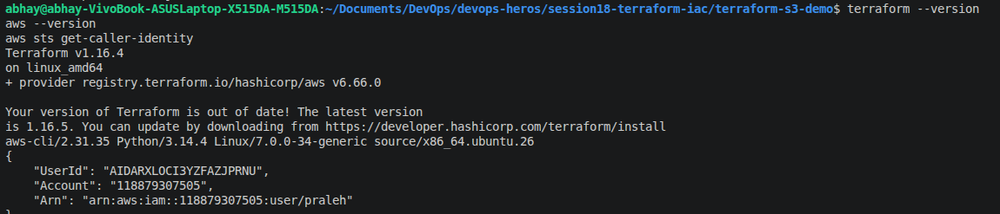
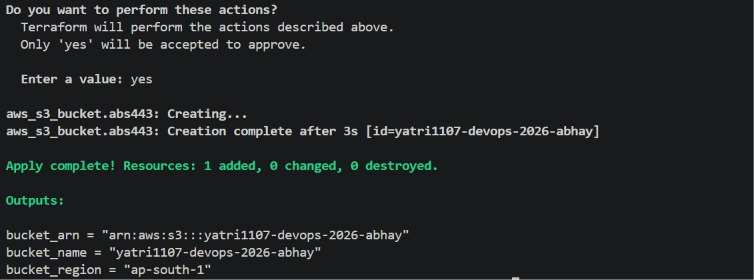

# Session 18 Terraform Assignment: S3 Bucket

This assignment uses Terraform to configure and create an Amazon S3 bucket. The screenshots below show the command-line workflow. Run the commands from the `terraform-s3-demo` directory:

```bash
cd ../terraform-s3-demo
```

## 1. Check Terraform and AWS CLI

Confirm that Terraform and the AWS CLI are installed, then check which AWS identity Terraform will use:

```bash
terraform --version
aws --version
aws sts get-caller-identity
```

The identity command displays the active AWS account and IAM user or role.



## 2. Initialize and validate

Initialize the working directory to install the configured provider. Format and validate the Terraform files before planning:

```bash
terraform init
terraform fmt
terraform validate
```


## 3. Review the plan

Generate a plan and check the resource name, bucket name, region, and proposed actions. The plan shown creates one bucket and makes no other changes:

```bash
terraform plan
```


## 4. Apply the configuration

Apply only after reviewing the plan. Terraform asks for confirmation; enter `yes` to proceed:

```bash
terraform apply
```


The following screenshot shows a successful apply from an earlier run:



`img2.jpeg`, `img3.jpeg`, and `img4.jpeg` are identical copies of `img1.jpeg`.

## 5. Inspect the result

After a successful apply, inspect Terraform's state and outputs, then list buckets visible to the configured AWS identity:

```bash
terraform state list
terraform output
aws s3 ls
```

## 6. Clean up

When the assignment is complete, destroy the Terraform-managed resources if you no longer need them. Review the proposed deletion and confirm with `yes`:

```bash
terraform destroy
```

## AWS permission note

The successful-apply screenshot is from an earlier run: it shows a different AWS account and the bucket `yatri1107-devops-2026-abhay`. The current configuration uses `praleh-terraformer007`. An AWS Organizations service control policy explicitly denied `s3:CreateBucket` for the current account, so an IAM allow alone will not make the apply succeed. An Organizations administrator must remove or narrow the matching SCP deny before creation is permitted.
