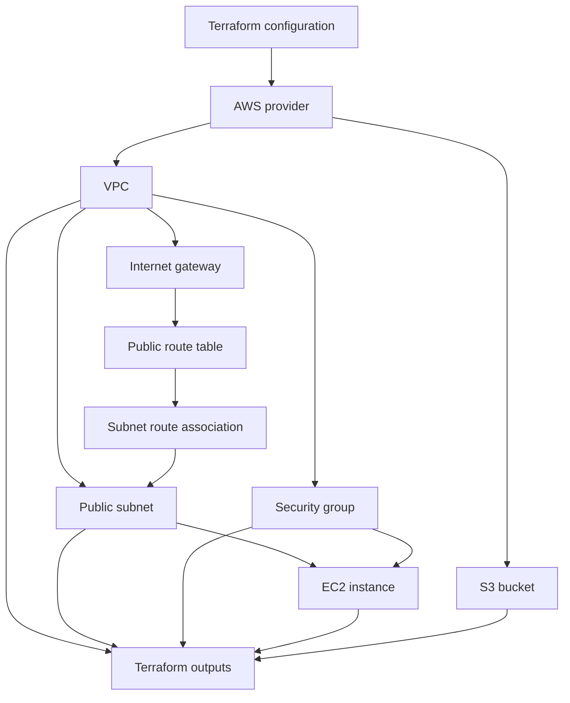
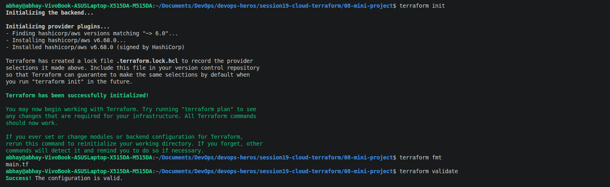
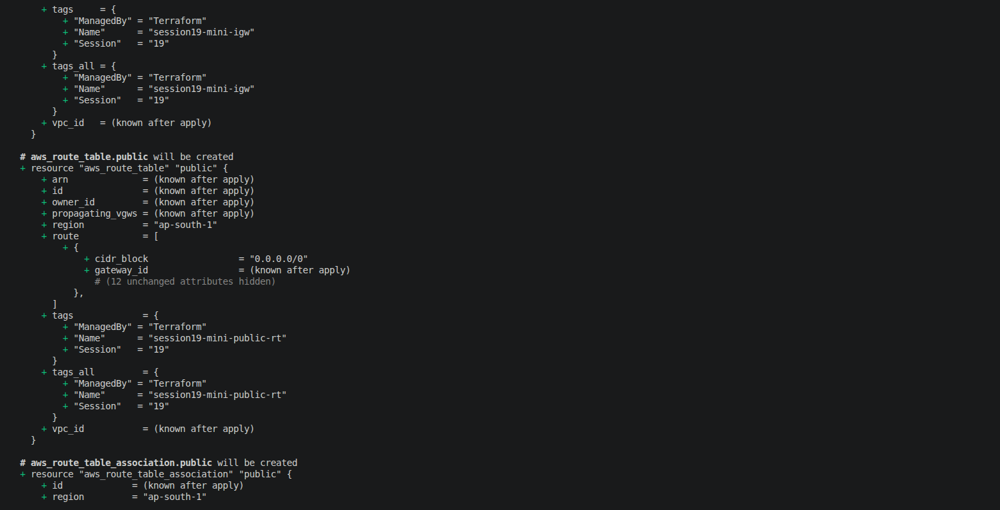
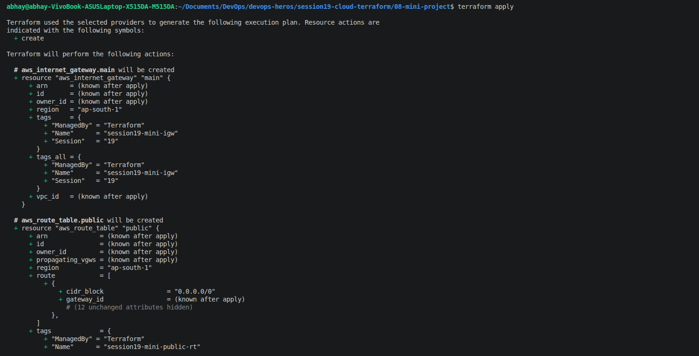
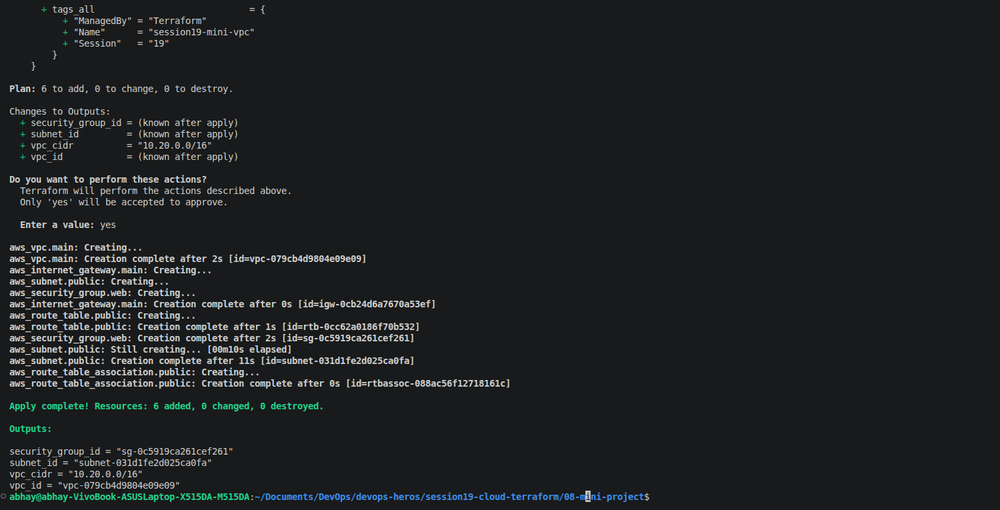
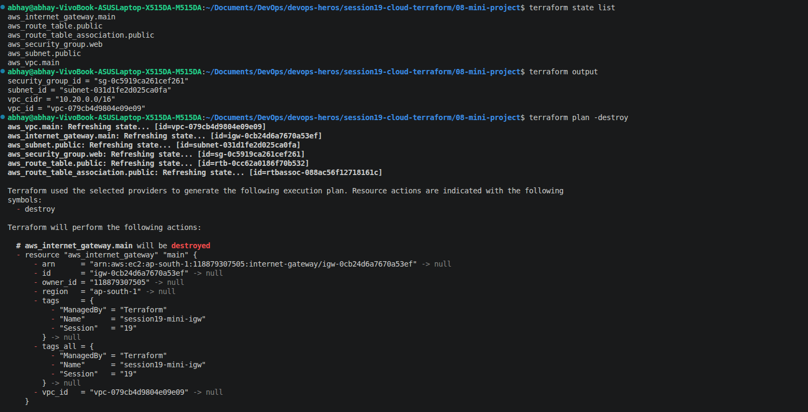
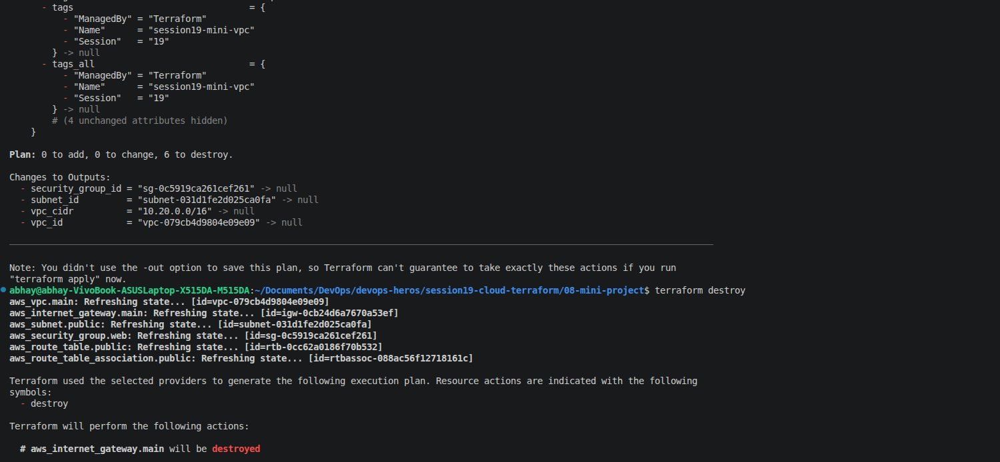
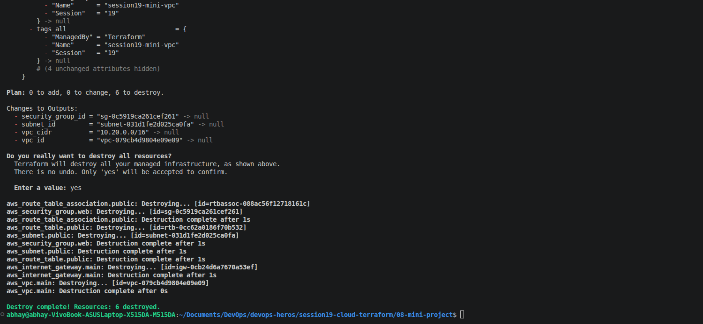

# Session 19: Cloud & Terraform in Action

## Task

Build an end-to-end AWS infrastructure project with Terraform. Demonstrate provider configuration, variables, resources, outputs, resource dependencies, Terraform state, and the `plan`, `apply`, and `destroy` workflow.

## Target Architecture



The S3 bucket is a separate AWS resource; it does not belong inside the VPC. Choose a globally unique bucket name using lowercase letters, numbers, and hyphens.

## Terraform Concepts to Demonstrate

- **Provider:** Configure the HashiCorp AWS provider and deployment region.
- **Variables:** Configure values such as AWS region, network CIDRs, EC2 settings, and bucket name.
- **Resources:** Define the VPC, subnet, internet gateway, route table and association, security group, EC2 instance, and S3 bucket.
- **Dependencies:** Reference resource attributes, such as the VPC ID in subnet and security-group resources, so Terraform can build the dependency graph.
- **Outputs:** Print useful values such as VPC ID, subnet ID, security group ID, EC2 public IP, and S3 bucket name/ARN.
- **State and workflow:** Review the plan, apply approved changes, inspect Terraform state, and destroy resources when finished.

## Current Project Status

The configuration in [`08-mini-project`](../08-mini-project/README.md) currently provisions the VPC networking foundation: VPC, public subnet, internet gateway, web security group, public route table, and route-table association. The screenshots below show a successful apply of those six resources. EC2 and S3 are part of the target assignment architecture but are not yet defined in the current Terraform configuration; add them before treating the complete target architecture as deployed.

## Run the Terraform Workflow

From the repository root, enter the project directory, create the local variables file, and check the AWS identity:

```bash
cd session19-cloud-terraform/08-mini-project
cp terraform.tfvars.example terraform.tfvars
aws sts get-caller-identity
```

Initialize the provider, format the files, validate the configuration, and review the proposed changes:

```bash
terraform init
terraform fmt
terraform validate
terraform plan
```

Apply only after reviewing the plan. Enter `yes` at Terraform's confirmation prompt:

```bash
terraform apply
```

Inspect the resources and outputs recorded in Terraform state:

```bash
terraform state list
terraform output
```

Review and destroy the resources when the assignment is complete:

```bash
terraform plan -destroy
terraform destroy
```

Confirm the destroy operation by entering `yes`. This removes Terraform-managed resources and may affect anything depending on them.

## Screenshots

These screenshots document the current VPC networking implementation:

1. Provider initialization, formatting, and validation:

	

2. Plan showing the network resources, including the public route table:

	

3. Apply starting resource creation:

	

4. Successful apply showing six resources created and output values:

	

5. Terraform state and outputs, followed by a destroy plan for the six resources:

	

6. Destroy command and resource cleanup in progress:

	

7. Confirmation prompt and successful cleanup of all six resources:

	

These screenshots document the complete workflow for the current VPC networking implementation, including state inspection and cleanup. For the final end-to-end architecture deliverable, add EC2 and S3 to the Terraform configuration and capture updated plan/apply/output screenshots that include those resources.

## Deliverables

- Terraform project files with AWS provider, variables, resources, outputs, and implicit dependencies.
- AWS infrastructure matching the target architecture: VPC, subnet, security group, EC2, and S3, with required network resources.
- Architecture diagram showing resource relationships.
- README with setup, Terraform commands, verification, and cleanup instructions.
- Screenshots of plan, apply, outputs/state, and destroy for the completed project.
