# Session 20: Monitoring, Observability & GitOps

This assignment demonstrates Kubernetes monitoring with Prometheus and Grafana, explains the metrics/logs/traces observability model, and deploys an application through Argo CD GitOps.

## Task 1: Monitoring

Monitoring answers: **Is the system healthy?** Metrics such as CPU, memory, request rate, and error rate let us track known conditions over time. Dashboards make these signals visible, and alerts notify an operator when a threshold or health condition needs attention.

### Monitoring demo

Create the local Kubernetes cluster shown in the screenshots and check its health:

```bash
kind create cluster --name session20 --image kindest/node:v1.33.1
kubectl get nodes
kubectl get pods -A
```

Install the Prometheus community stack. It includes Prometheus, Grafana, Alertmanager, and Kubernetes metric exporters:

```bash
helm repo add prometheus-community https://prometheus-community.github.io/helm-charts
helm repo update
helm install monitoring prometheus-community/kube-prometheus-stack \
	--namespace monitoring --create-namespace
kubectl get pods -n monitoring
```

Port-forward Grafana and retrieve the generated admin password:

```bash
kubectl port-forward -n monitoring svc/monitoring-grafana 3000:80
kubectl get secret monitoring-grafana -n monitoring \
	-o jsonpath='{.data.admin-password}' | base64 --decode; echo
```

Open `http://localhost:3000` and sign in as `admin` with the retrieved password. Prometheus is available inside the cluster as the Grafana data source provisioned by the chart.

### Screenshot map: monitoring

**Cluster and monitoring stack setup**

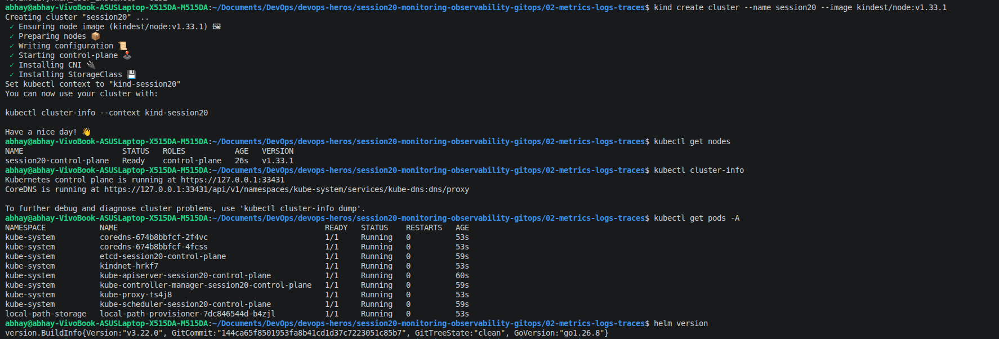

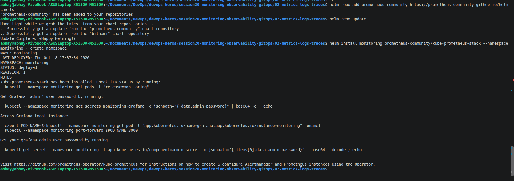

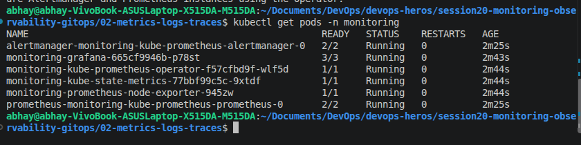

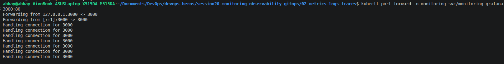

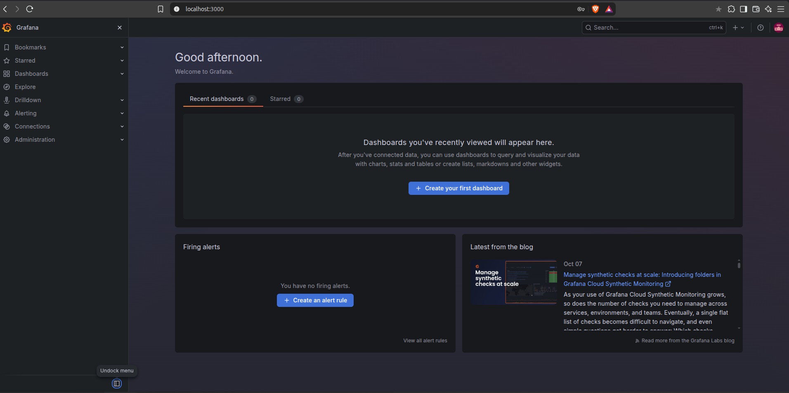

**Metrics, utilization, and application health**

The Kubernetes compute dashboard displays CPU and memory utilization, requests, limits, and usage by namespace:

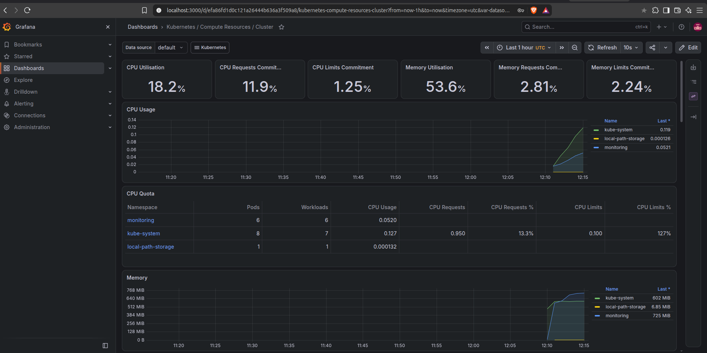

The Prometheus `up` query checks whether scrape targets are healthy (`1` means up):

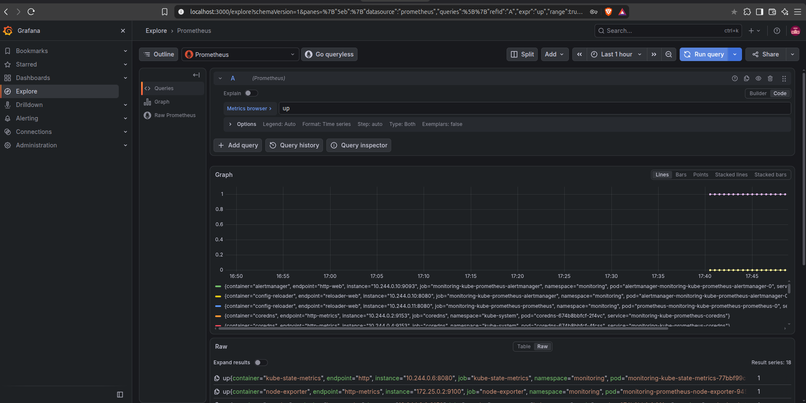

The CPU utilization query shown in the screenshot is:

```promql
100 * (1 - avg(rate(node_cpu_seconds_total{mode="idle"}[5m])))
```

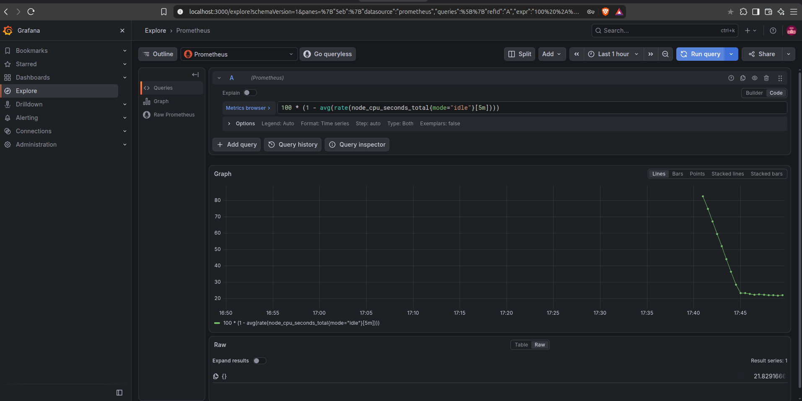

The memory utilization query is:

```promql
100 * (1 - node_memory_MemAvailable_bytes / node_memory_MemTotal_bytes)
```

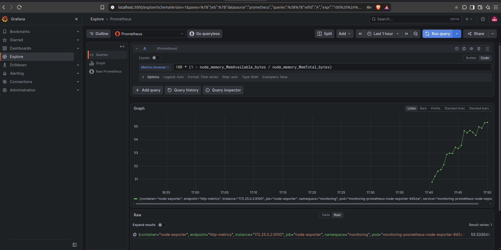

The Grafana Alerting screenshot shows available Prometheus-managed rule groups. It does **not** show a custom Grafana-managed alert rule or a firing notification; configure a threshold rule and notification contact point to demonstrate those behaviors.

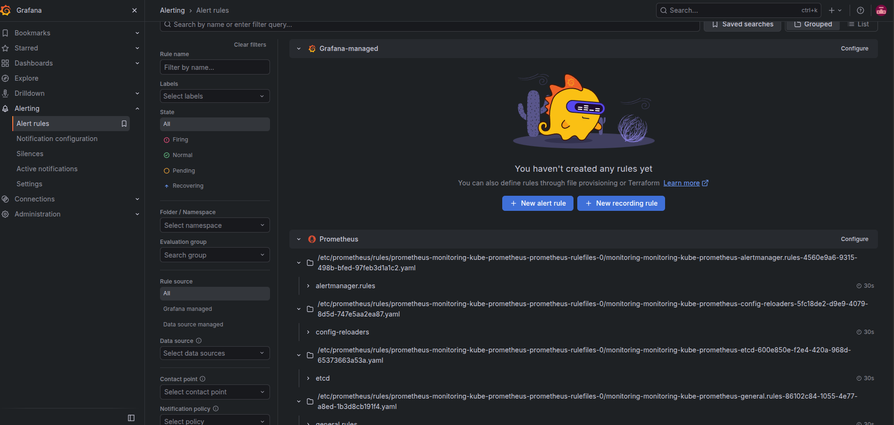

The demo application screenshot shows an nginx deployment and its ready pod. Check readiness and inspect application logs with:

```bash
kubectl get deployment demo-app -n apps
kubectl get pods -n apps -l app=demo-app
kubectl logs deployment/demo-app -n apps --tail=100
```

Use the namespace where the demo deployment was created if it differs from `apps`.

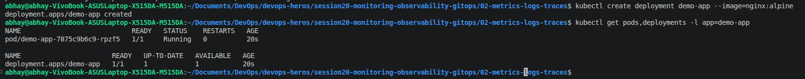

The cluster-wide pod list also shows the monitoring and Argo CD components running:

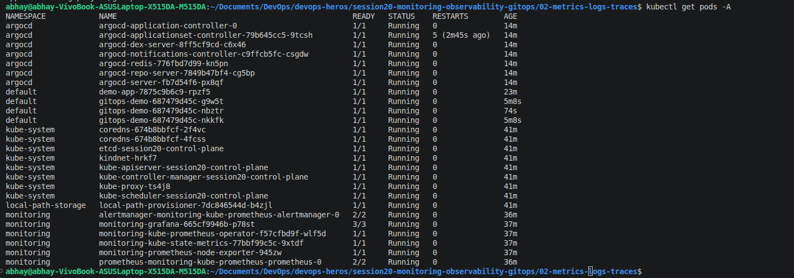

## Task 2: Observability

Monitoring is useful for known failure signals. **Observability** helps investigate why a system behaves unexpectedly by examining its outputs and correlating evidence across components.

### Three pillars

| Pillar | Meaning | Example question |
| --- | --- | --- |
| **Metrics** | Numeric measurements recorded over time, usually aggregated and labeled. | How much CPU is the node using? How often are requests failing? |
| **Logs** | Timestamped events or messages emitted by applications and infrastructure. | What error occurred immediately before the request failed? |
| **Traces** | A request's path through services, represented as spans linked by a trace ID. | Which service or database call made this request slow? |

Metrics identify a symptom, logs provide event detail, and traces show where time or errors accumulated across a distributed request. Used together, they make it easier to diagnose unknown failure modes, reduce time to recovery, and understand system behavior rather than only detecting that a threshold was crossed.

### Common tools

- **Metrics:** Prometheus, Grafana, kube-state-metrics, and node-exporter.
- **Logs:** `kubectl logs` for direct inspection; Loki, Elasticsearch/OpenSearch, or an equivalent centralized store for aggregation and search.
- **Traces:** OpenTelemetry for instrumentation and collection; Jaeger or Grafana Tempo for trace storage and exploration.
- **Alerting:** Prometheus Alertmanager and Grafana Alerting for rule evaluation and notifications.

### Kubernetes observability

In Kubernetes, exporters and kubelet/cAdvisor expose node, pod, and container measurements. Prometheus scrapes these metrics, while kube-state-metrics reports Kubernetes object state such as deployment replicas. Grafana visualizes the data. Logs can be read from a pod with `kubectl logs` or shipped to a centralized backend. For traces, instrument services with OpenTelemetry and send spans through an OpenTelemetry Collector to a backend such as Tempo or Jaeger. Labels, pod metadata, timestamps, and trace IDs help correlate signals.

The screenshots demonstrate Prometheus metrics and Grafana dashboards. They do not show a centralized log backend or an instrumented distributed trace; those are described here as observability concepts rather than claimed as deployed demos.

## Task 3: GitOps

**GitOps** manages the desired state of infrastructure and applications declaratively in Git. Git is the reviewed source of truth; a controller such as Argo CD continuously compares that desired state with the live Kubernetes cluster and reconciles differences.

### GitOps workflow

1. Define Kubernetes resources declaratively in manifests and commit them to Git.
2. Argo CD watches the configured repository, branch, and path.
3. Argo CD compares the Git state with the cluster state.
4. It synchronizes changes and reports sync and health status.
5. With automated sync and self-heal enabled, it can restore live resources that drift from Git.

### GitOps demo commands

The screenshot's Argo CD application manifest is in `02-metrics-logs-traces/gitops/argocd-app.yaml`. It points to the repository's `lec20` branch and enables automated sync and self-heal.

Install Argo CD in the Kind cluster and wait for its pods to start:

```bash
kubectl create namespace argocd
kubectl apply -n argocd \
	-f https://raw.githubusercontent.com/argoproj/argo-cd/stable/manifests/install.yaml
kubectl get pods -n argocd
```

In a separate terminal, forward the Argo CD server and open `https://localhost:8080`:

```bash
kubectl port-forward -n argocd svc/argocd-server 8080:443
```

Apply the application manifest from the repository root and check sync and workload health:

```bash
kubectl apply -f session20-monitoring-observability-gitops/02-metrics-logs-traces/gitops/argocd-app.yaml
kubectl get applications -n argocd
kubectl get deployment gitops-demo
kubectl get pods -A
```

The manifest destination is the `default` namespace. The screenshots show the `gitops-demo` application as `Synced` and `Healthy`, with two ready deployment replicas.

### Screenshot map: GitOps

The Grafana chart repository is added and refreshed as part of the monitoring setup:

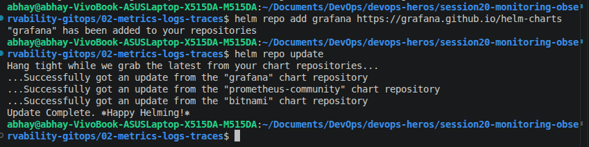

This image shows the Argo CD Applications page before an application has been created:

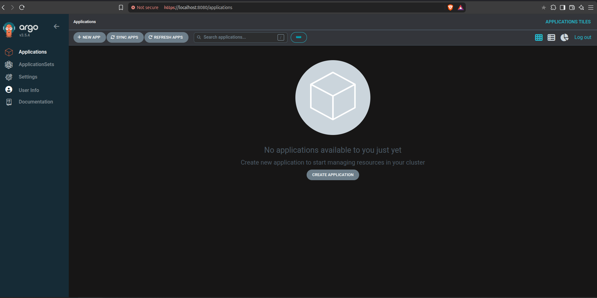

The terminal screenshot shows Argo CD pods running and the server being port-forwarded:

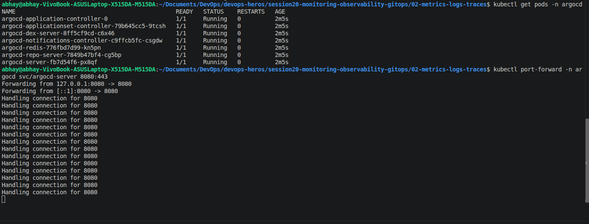

The application manifest is applied and Argo CD reports the app as Synced and Healthy:

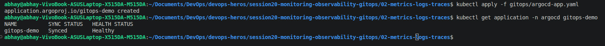

The final GitOps terminal captures show the deployment at `2/2`, healthy application status, and an Argo CD hard-refresh annotation:

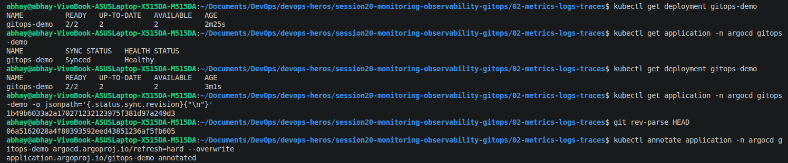

The cluster-wide pod list includes the Argo CD and monitoring namespaces:


These screenshots show a healthy synchronized deployment. They do not capture a Git commit or a demonstrated change propagating from Git; to complete that part of the workflow, change a manifest in the watched repository, commit and push it, then verify that Argo CD reconciles the deployment.


## Cleanup

```bash
kind delete cluster --name session20
```
