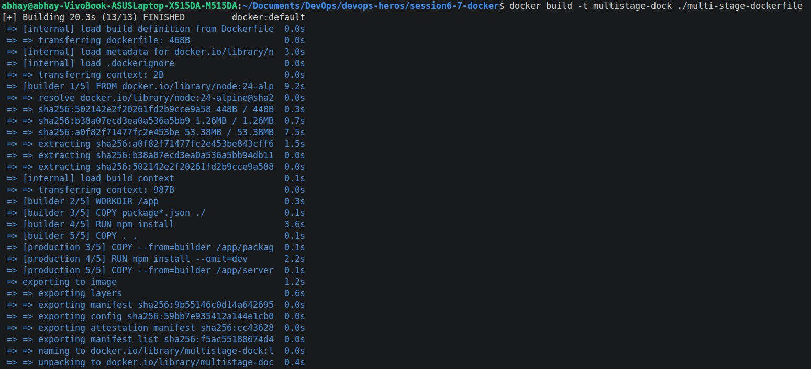
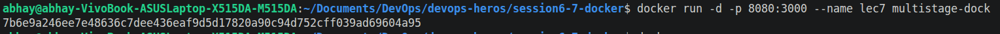
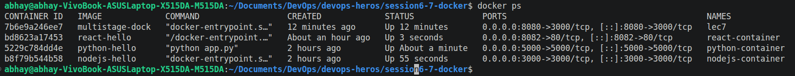
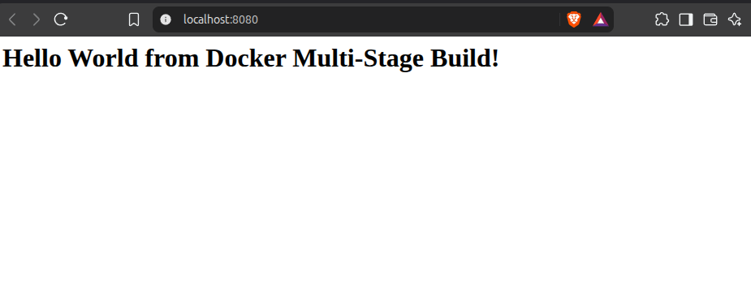
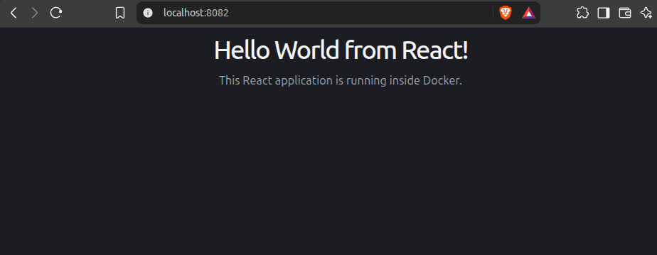

# Lecture 7 Graded Homework

## Task 1: Run Multi-Stage Dockerfile
- Clone the repository containing the multi-stage Dockerfile.
- Build the Docker image using the multi-stage Dockerfile.
- Run a container from the image.
- Access the application running inside the container.
- Verify that the application displays:
- Hello World from Docker multi-stage build
- Verify the running container using docker ps.
- Confirm that the application is running on port 8080.

> Already did all the above steps, see Documentation Task. 

## Task 2: Documentation
- Name : Abhay Singh Bhadauria

- Enrollment Number : 24BCS10102

- Build stage :

- Running container : 

- Browser output :

## Task 3:  
- Browser Outputs:

