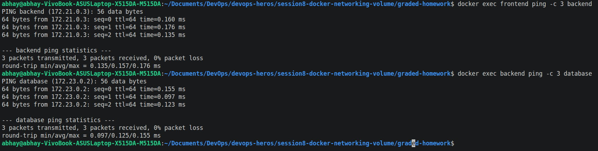
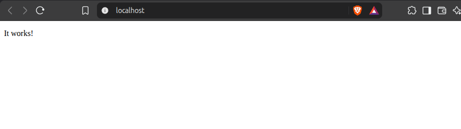
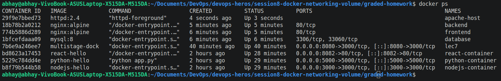
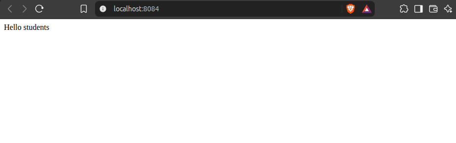
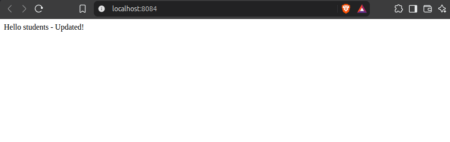

# Lecture 8 Graded Homework

## Task 1: Docker Container Networking
- Create 3 containers:
    - Frontend
    - Backend
    - Database
- Use Nginx or Alpine images for the frontend and backend.
- Use the MySQL image for the database.
- Create 3 different Docker networks.
- Add the backend container to 2 networks.
- Check connectivity between the containers.

# Lecture 8 Graded Homework

## Task 1: Docker Container Networking
- Create 3 containers:
    - Frontend
    - Backend
    - Database
- Use Nginx or Alpine images for the frontend and backend.
- Use the MySQL image for the database.
- Create 3 different Docker networks.
- Add the backend container to 2 networks.
- Check connectivity between the containers.

### Conectivity Check:

> Containers on the same network can communicate with each other, while containers on different networks cannot communicate unless they are connected to both networks.

## Task 2: Host Network
- Pull the Apache2 image from Docker Hub.
- Create an Apache2 container using the host network.
- Access the Apache website directly on port 80.

### Terminal Output:

### Browser Output:

## Task 3: Bind Mount
- Create a folder on your local machine.
- Create an index.html file with Hello students as the content.
- Bind mount the folder to an Nginx container.
- Access the Nginx website and verify the content.
- Modify the index.html file.
- Verify that the changes are reflected without restarting the container.

### Browser Output 1:

### Browser Output 2:

## Task 4: Overlay Network
An Overlay Network in Docker is a virtual network that allows containers running on different Docker hosts to communicate with each other as if they were on the same network.

It is mainly used in Docker Swarm and other multi-host environments. For example, if one container is running on Server 1 and another container is running on Server 2, an overlay network can connect them and allow communication between them.

### My Understanding of Overlay Networks:
Each Docker host runs its own Docker engine. The overlay network creates a virtual network that spans across these hosts. Docker handles the communication between containers on different hosts.

### How it works
Unlike a normal bridge network, which normally works within a single Docker host, an overlay network can connect containers or services across multiple Docker hosts.

### Use cases
Running distributed applications across multiple Docker hosts.
Connecting frontend, backend, and database services running on different servers.
Used with Docker Swarm for service-to-service communication.
Provides network isolation between different applications or services.