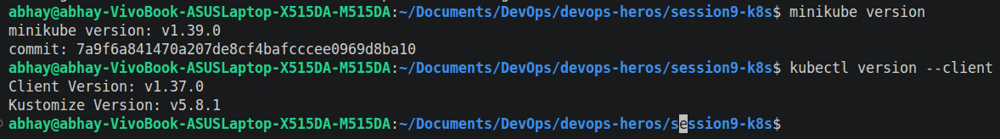
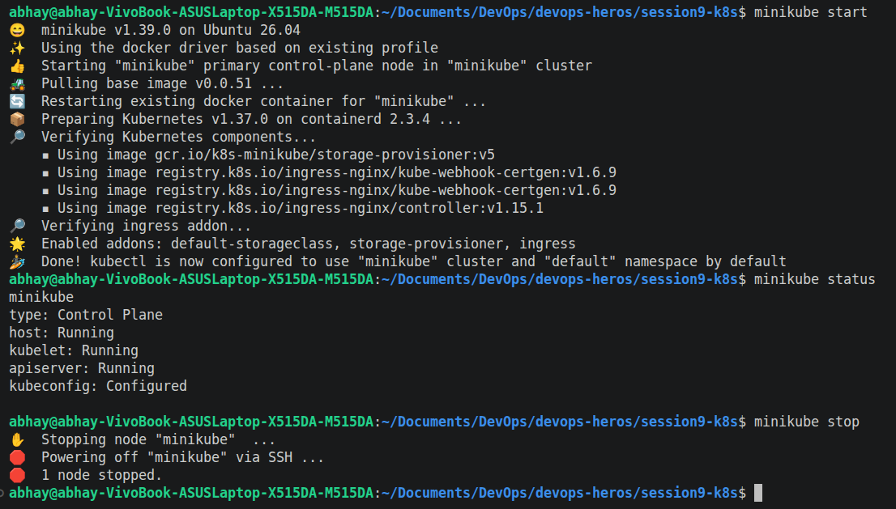

# Session 9: Kubernetes Fundamentals & Cluster Architecture

**Author:** Abhay Singh Bhadauria

**Course:** SST DevOps & Cloud [SWE]

**Session:** 09 - Kubernetes Fundamentals

**Repository:** `devops-heros / session9-k8s`

## Task 1: Minikube & CLI Installation Verification

Verify that Minikube and the Kubernetes CLI (`kubectl`) are successfully installed on the local system.

**Commands:**
```bash
minikube version
kubectl version --client
```

**Output:**



## Minikube Cluster Lifecycle Execution:


## Kubernates Architecture & Core Components Analysis:
### 1. Control Plane (Master Node) Components

- **`kube-apiserver`** – **The Front Door**
  - Entry point for all Kubernetes API requests.
  - Handles authentication and communication with cluster components.
  - Only component that directly communicates with `etcd`.

- **`etcd`** – **The State Store**
  - Distributed key-value store for Kubernetes.
  - Stores cluster state, configurations, secrets, and metadata.

- **`kube-scheduler`** – **The Placement Engine**
  - Finds Pods that are not assigned to a node.
  - Selects a suitable worker node based on CPU, memory, affinity, taints, and tolerations.

- **`kube-controller-manager`** – **The Reconciliation Engine**
  - Continuously compares **desired state** with **current state** and makes corrections.
  - Includes controllers such as:
    - **Node Controller** – Monitors node health.
    - **ReplicaSet Controller** – Maintains the required number of Pods.
    - **Service Controller** – Maintains Service-to-Pod networking.

### 2. Worker Node (Data Plane) Components

- **`kubelet`** – **The Node Captain**
  - Runs on every worker node.
  - Receives Pod instructions and manages containers through the container runtime.
  - Monitors Pod health and reports status to the API server.

- **`kube-proxy`** – **The Network Router**
  - Maintains network rules on each node.
  - Enables Services to route and load-balance traffic to Pods.

- **Container Runtime** – **Runs Containers**
  - Responsible for pulling images and running containers.
  - Common runtimes include **`containerd`** and **`CRI-O`**.

- **`Pod`** – **Smallest Deployable Unit**
  - Basic execution unit in Kubernetes.
  - Contains one or more containers sharing network and storage resources.
